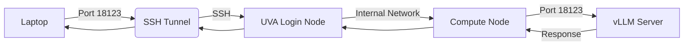

# UVA FastAPI + vLLM (Gemma) + SSH Tunnel Workflow

**Contact**: **Gregor von Laszewski** ([laszewski@gmail.com](mailto:laszewski@gmail.com))

## Overview

This workflow provides a complete guide to deploying and accessing a **Gemma 4** large language model using the **vLLM** high-throughput serving engine on the UVA cluster.

Because the model requires significant GPU resources, it is hosted on a UVA GPU compute node. To interact with the server from a local machine, we use an SSH tunnel to securely forward traffic from the laptop to the specific compute node allocated by the cluster.

---

# Quick Start

## 🚀 Quick Start (Easy)
For most users, the `commander` tool automates the entire process. Note that you will need two terminal windows to keep the tunnel active while testing.

**Window 1: Management (Keep this window open!)**
1. **VPN**: `cmc vpn connect`
2. **Deploy**: `cmc commander run vllm`

**Window 2: Testing/Usage**
3. **Test**: `curl http://localhost:18123/v1/models`

## 🛠️ Quick Start (Advanced)
For users who need manual control over the cluster job and server parameters. This requires three separate terminal windows.

**Window 1: Management & Deployment**
1. **VPN**: `cmc vpn connect`
2. **SSH**: `ssh uva`
3. **GPU**: `ijob --partition=bii-gpu ...`
4. **Server**: `apptainer run ... vllm_gemma4.sif ...`

**Window 2: Tunneling (Keep this window open!)**
5. **Tunnel**: `ssh -L 18123:compute-node:18123 uva`

**Window 3: Testing/Usage**
6. **Test**: `curl http://localhost:18123/v1/chat/completions ...`

---

# Installation

Before deploying the service, you must install the `cloudmesh-ai-commander` tool to manage the orchestration.

## 1. Setup Environment
We recommend using `pyenv` to manage your Python version and virtual environment.

<span style="color: #007bff;"><span style="font-size: 2em;">❶</span> [terminal 1 - laptop]</span>
```bash
# Create a virtual environment for the commander
pyenv virtualenv 3.14.4 CMC
pyenv local CMC
```

## 2. Install from Source
Install the package in editable mode directly from the source repository.

<span style="color: #007bff;"><span style="font-size: 2em;">❶</span> [terminal 1 - laptop]</span>
```bash
# Clone the repository
git clone https://github.com/cloudmesh-ai/cloudmesh-ai-commander.git
cd cloudmesh-ai-commander

# Install in editable mode
pip install -e .
```

---

# Environment Variables

The following variables are required for the server to function correctly:

| Variable | Source | Purpose |
| :--- | :--- | :--- |
| `HF_TOKEN` | `$HOME/.config/cloudmesh/llm/HF_token.txt` | Authenticates with HuggingFace to download model weights |
| `VLLM_API_KEY` | `$HOME/.config/cloudmesh/llm/server_master_key.txt` | Secures the vLLM API endpoint |

---

# Nomenclature

To make this guide easier to follow, we use the following shorthand for terminals and hosts:

| Icon | Terminal | Role | Host | Description |
| :--- | :--- | :--- | :--- | :--- |
| <span style="color: #007bff;"><span style="font-size: 2em;">❶</span></span> | **Terminal 1** | Management | `uva` / `compute-node` | Cluster login, resource allocation, and server startup |
| <span style="color: #28a745;"><span style="font-size: 2em;">❷</span></span> | **Terminal 2** | Tunneling | `laptop` $\rightarrow$ `uva` | Dedicated session to maintain the SSH tunnel |
| <span style="color: #fd7e14;"><span style="font-size: 2em;">❸</span></span> | **Terminal 3** | Testing | `laptop` | Session for API verification and requests |

---

# 1. SSH Configuration

Before connecting, you should configure your local SSH client to simplify connections to the UVA cluster.

## 1.1 Configure SSH Config
Add the following block to your `~/.ssh/config` file on your laptop.

```text
Host uva
    HostName login.hpc.virginia.edu
    User thf2bn
    ForwardAgent yes
    ServerAliveInterval 60
```

## 1.2 Set Up SSH Key Agent
<span style="color: #007bff;"><span style="font-size: 2em;">❶</span> [terminal 1 - laptop]</span>
```bash
eval $(ssh-agent -s)
ssh-add ~/.ssh/id_rsa
```

## 1.3 Upload Public Key
<span style="color: #007bff;"><span style="font-size: 2em;">❶</span> [terminal 1 - laptop]</span>
```bash
ssh-copy-id uva
```

**✅ Success Criteria**
- [ ] `ssh uva` connects without a password.

---

# 2. VPN Connection

## 2.1 Connect to UVA
<span style="color: #007bff;"><span style="font-size: 2em;">❶</span> [terminal 1 - laptop]</span>
```bash
cmc vpn connect
```

---

# 3. laptop → UVA

## 3.1 SSH into UVA
<span style="color: #007bff;"><span style="font-size: 2em;">❶</span> [terminal 1 - laptop]</span>
```bash
ssh uva
```

---

# 4. uva → login node → cluster job

## 4.1 Start GPU job
The following command requests 4x A100 GPUs to accommodate the Gemma 4 31B model.

<span style="color: #007bff;"><span style="font-size: 2em;">❶</span> [terminal 1 - uva]</span>
```bash
ijob --partition=bii-gpu \
     --reservation=bi_fox_dgx \
     --account=bi_dsc_community \
     --gpus=a100:4 \
     --cpus-per-task=32 \
     --mem=96gb \
     --time=03:00:00
```
You will be allocated a compute node (e.g., `udc-an26-1`).

---

# 5. Start vLLM Server

## 5.1 Automated Deployment (Recommended)
The easiest way to deploy the server is using the `cloudmesh-ai-commander` tool. This single command handles the GPU allocation (iJob), server deployment, and SSH tunnel setup automatically.

<span style="color: #007bff;"><span style="font-size: 2em;">❶</span> [terminal 1 - laptop]</span>
```bash
cmc commander run vllm
```
**What this does:**
- Requests a GPU node on the `bii-gpu` partition.
- Synchronizes your credentials to the remote node.
- Deploys and starts the vLLM server using Apptainer.
- Opens a local SSH tunnel on port `18123`.

---

## 5.2 Manual Deployment (Advanced)
If you prefer to manage the process manually or need to debug the startup, follow these steps.

### 5.2.1 Set Environment Variables
<span style="color: #007bff;"><span style="font-size: 2em;">❶</span> [terminal 1 - compute-node]</span>
```bash
export HF_TOKEN=$(cat $HOME/.config/cloudmesh/llm/HF_token.txt)
export VLLM_API_KEY=$(cat $HOME/.config/cloudmesh/llm/server_master_key.txt)
```

### 5.2.2 Run vLLM with Apptainer
<span style="color: #007bff;"><span style="font-size: 2em;">❶</span> [terminal 1 - compute-node]</span>
```bash
cd /scratch/thf2bn
module load apptainer
apptainer run --nv \
  -B /scratch/thf2bn/hf_cache:/root/.cache/huggingface \
  --env HF_TOKEN="${HF_TOKEN}" \
  --env VLLM_API_KEY="${VLLM_API_KEY}" \
  vllm_gemma4.sif \
  --model google/gemma-4-31B-it \
  --tensor-parallel-size 4 \
  --gpu-memory-utilization 0.85 \
  --max-model-len 131072 \
  --enable-prefix-caching \
  --load-format safetensors \
  --tool-call-parser gemma4 \
  --host 0.0.0.0 \
  --port 18123
```

> [!IMPORTANT]
> **Wait for the server to fully load.** Look for "Application startup complete" in the logs.

---

# 6. laptop → SSH tunnel

## 6.1 Open tunnel
<span style="color: #28a745;"><span style="font-size: 2em;">❷</span> [terminal 2 - laptop]</span>
```bash
ssh -L 18123:udc-an26-1:18123 uva
```
*(Replace `udc-an26-1` with your actual allocated node)*

---

# 7. laptop → test service

## 7.1 Verify endpoint
<span style="color: #fd7e14;"><span style="font-size: 2em;">❸</span> [terminal 3 - laptop]</span>
```bash
export VLLM_API_KEY=$(ssh uva "cat \$HOME/.config/cloudmesh/llm/server_master_key.txt")

curl http://localhost:18123/v1/models \
  -H "Authorization: Bearer $VLLM_API_KEY"
```

---

# Mental Model



---

# Rules

> [!CAUTION]
> - **Start ijob before server**: You cannot run the server without a GPU allocation.
> - **Start server before tunnel**: The tunnel needs a destination port to be listening.
> - **Never SSH directly into compute nodes**: Always go through the login node.
> - **Keep tunnel open**: Terminal 2 must remain active.

---

# Troubleshooting

### 🔑 Missing or Empty Credentials
If you see an error regarding `HF_token.txt` or `server_master_key.txt`, it means your local configuration is incomplete.

**Required Files:**
- `~/.config/cloudmesh/llm/HF_token.txt` $\rightarrow$ Your HuggingFace Read Token.
- `~/.config/cloudmesh/llm/server_master_key.txt` $\rightarrow$ A random string to serve as your API key.

**How to fix:**
1. Create the directory: `mkdir -p ~/.config/cloudmesh/llm`
2. Create the files and add your tokens:
   ```bash
   echo "your_hf_token_here" > ~/.config/cloudmesh/llm/HF_token.txt
   echo "your_random_api_key_here" > ~/.config/cloudmesh/llm/server_master_key.txt
   ```
3. Rerun `cmc commander run vllm`.

---

# Max Performance Config

For single-user maximum performance on 4x A100 80GB using Apptainer on UVA:

```bash
apptainer run --nv \
  -B /scratch/thf2bn/hf_cache:/root/.cache/huggingface \
  --env HF_TOKEN="${HF_TOKEN}" \
  --env VLLM_API_KEY="${VLLM_API_KEY}" \
  vllm_gemma4.sif \
  --model google/gemma-4-31B-it \
  --tensor-parallel-size 4 \
  --gpu-memory-utilization 0.95 \
  --max-model-len 131072 \
  --enable-prefix-caching \
  --load-format safetensors \
  --enable-auto-tool-choice \
  --tool-call-parser gemma4 \
  --host 0.0.0.0 \
  --port 18123
```

---

# Appendix: Custom Configuration & Scripting

If you need to use a different model, change GPU parameters, or modify the deployment bash script without changing the installed package, you can use the export and directory override features.

## 1. Export Default Configuration
Export the current default `config.yaml` and `vllm_cmd.txt` to a local directory:

```bash
cmc commander export --dir ./my-ai-config
```

## 2. Modify Settings
You can now edit the files in `./my-ai-config`:
- **`config.yaml`**: Change the model name, `tensor_parallel_size`, or `remote_scratch_path`.
- **`vllm_cmd.txt`**: Modify the Apptainer run command or add environment variables.

## 3. Run with Custom Directory
Use the `--dir` flag to tell the commander to use your modified files instead of the defaults:

```bash
cmc commander run vllm --dir ./my-ai-config
```

**Priority Logic:**
When `--dir` is specified, the tool looks for files in this order:
1. Custom file specified via `--config` (highest priority).
2. `config.yaml` inside the `--dir` directory.
3. Internal package default `config.yaml` (fallback).

The same logic applies to `vllm_cmd.txt`.

---

# Appendix: Port Management

By default, the commander uses port `18123`. However, you can change this if the port is already in use on your laptop or if you are running multiple model instances.

## 1. Permanent Configuration (Recommended)
To set a default port for all your future commands, use the `init` command. This creates a user-specific configuration file at `~/.config/cloudmesh/llm/config.yaml`.

```bash
cmc commander init --port 19000
```
After running this, all `run`, `status`, and `stop` commands will use port `19000` by default.

## 2. Temporary Override
If you need to use a different port for a single session without changing your global settings, use the `--port` flag:

```bash
cmc commander run vllm --port 19000
```

## 3. Port Resolution Priority
The tool determines which port to use based on the following priority (highest to lowest):
1. **CLI Argument**: The value passed via `--port` in the command.
2. **User Config**: The `default_port` value in `~/.config/cloudmesh/llm/config.yaml`.
3. **Package Default**: The hardcoded default in the `cloudmesh-ai-commander` package.

---

# Appendix: Sharing the Service

By default, the `commander` tool sets up a **Local SSH Tunnel**, which means the server is only accessible at `http://localhost:18123` on the laptop that started the tunnel. Other users cannot connect to your `localhost`.

However, because the vLLM server is running on a UVA compute node, it is accessible to any user who has the appropriate network permissions.

## How other users can connect
To allow a colleague to use the running service, provide them with the following information:

1. **VPN Access**: They must be connected to the UVA VPN (`cmc vpn connect`).
2. **Internal URL**: Instead of `localhost`, they must use the internal hostname of the compute node.
   - **Format**: `http://<compute-node-hostname>:18123/v1`
   - **Example**: `http://udc-an26-1:18123/v1`
3. **API Key**: They must use the same `VLLM_API_KEY` (the content of your `server_master_key.txt`).

### Prerequisites for Collaborators
If your colleagues want to use the `commander` tool to manage their own tunnel to your running server, they should perform the following setup:

1. **VPN**: `cmc vpn connect`
2. **Environment**:
   ```bash
   pyenv virtualenv 3.14.4 CMC
   pyenv local CMC
   ```
3. **Install Tool**:
   ```bash
   git clone https://github.com/cloudmesh-ai/cloudmesh-ai-commander.git
   cd cloudmesh-ai-commander
   pip install -e .
   ```
4. **Create Tunnel**:
   They can then run the tunnel command using the node you provided:
   ```bash
   cmc commander tunnel <compute-node-hostname> 18123 18123
   ```
   Now they can use `http://localhost:18123/v1` in their tools.

## Summary for Collaborators
If you are sharing the service, send your collaborator a message like this:
> "The Gemma 4 server is running on UVA. Connect to the VPN and use:
> - **URL**: `http://<node-name>:18123/v1`
> - **Key**: `<your-api-key>`"

---

# Appendix: Tool Configuration

Once the vLLM server is running and the SSH tunnel is active, you can connect various AI tools to your private Gemma 4 instance.

## Common Connection Settings
Regardless of the tool, use these settings to connect to the tunnel:

| Setting | Value | Note |
| :--- | :--- | :--- |
| **API Base URL** | `http://localhost:18123/v1` | The local end of the SSH tunnel |
| **API Key** | *(Your `server_master_key.txt` content)* | The key you defined during setup |
| **Model ID** | `google/gemma-4-31B-it` | Must match the model loaded in `config.yaml` |

## 🛠️ Tool-Specific Setup

### 1. Cline (VS Code Extension)
Cline allows you to use the model directly within your editor for coding.
1. Open **Cline Settings**.
2. Set **API Provider** $\rightarrow$ `OpenAI Compatible`.
3. **Base URL** $\rightarrow$ `http://localhost:18123/v1`
4. **API Key** $\rightarrow$ Paste your `server_master_key.txt` content.
5. **Model ID** $\rightarrow$ `google/gemma-4-31B-it`

### 2. Open WebUI
For a ChatGPT-like web interface:
1. Go to **Settings** $\rightarrow$ **Connections** $\rightarrow$ **OpenAI API**.
2. **API Base URL** $\rightarrow$ `http://localhost:18123/v1`
3. **API Key** $\rightarrow$ Paste your `server_master_key.txt` content.
4. Click **Save** and select the model from the dropdown in the chat interface.

### 3. CLI Tools (Claude-CLI, etc.)
Most CLI tools that support OpenAI-compatible APIs can be configured via environment variables:

```bash
export OPENAI_BASE_URL="http://localhost:18123/v1"
export OPENAI_API_KEY=$(cat ~/.config/cloudmesh/llm/server_master_key.txt)
```

### 4. Custom Python Scripts
Use the standard `openai` Python library:

```python
from openai import OpenAI

client = OpenAI(
    base_url="http://localhost:18123/v1",
    api_key="your_server_master_key_here"
)

response = client.chat.completions.create(
    model="google/gemma-4-31B-it",
    messages=[{"role": "user", "content": "Hello Gemma!"}]
)
print(response.choices[0].message.content)
```
