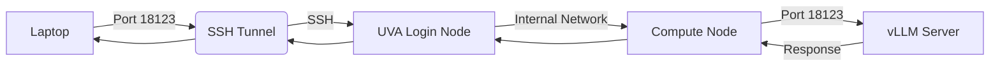

# UVA FastAPI + vLLM (Gemma) + SSH Tunnel Workflow

**Contact**: **Gregor von Laszewski** ([laszewski@gmail.com](mailto:laszewski@gmail.com))

## Overview

This workflow provides a complete guide to deploying and accessing a **Gemma 4** large language model using the **vLLM** high-throughput serving engine on the UVA cluster.

Because the model requires significant GPU resources, it is hosted on a UVA GPU compute node. To interact with the server from a local machine, we use an SSH tunnel to securely forward traffic from the laptop to the specific compute node allocated by the cluster.

---

# Quick Start

For returning users, here is the essential command sequence:

1. **VPN**: `cmc vpn connect`
2. **SSH**: `ssh uva`
3. **GPU**: `ijob --partition=bii-gpu ...`
4. **Server**: `apptainer run ... vllm_gemma4.sif ...`
5. **Tunnel**: `ssh -L 18123:compute-node:18123 uva`
6. **Test**: `curl http://localhost:18123/v1/chat/completions ...`

---

# Installation

Before deploying the service, you must install the `cloudmesh-ai-commander` tool to manage the orchestration.

## 1. Setup Environment
We recommend using `pyenv` to manage your Python version and virtual environment.

<span style="color: #007bff;"><span style="font-size: 2em;">❶</span> [terminal 1 - laptop]</span>
```bash
# Create a virtual environment for the commander
pyenv virtualenv 3.14.4 CMC
pyenv local CMC
```

## 2. Install from Source
Install the package in editable mode directly from the source repository.

<span style="color: #007bff;"><span style="font-size: 2em;">❶</span> [terminal 1 - laptop]</span>
```bash
# Clone the repository
git clone https://github.com/cloudmesh-ai/cloudmesh-ai-commander.git
cd cloudmesh-ai-commander

# Install in editable mode
pip install -e .
```

---

# Environment Variables

The following variables are required for the server to function correctly:

| Variable | Source | Purpose |
| :--- | :--- | :--- |
| `HF_TOKEN` | `$HOME/.config/cloudmesh/llm/HF_token.txt` | Authenticates with HuggingFace to download model weights |
| `VLLM_API_KEY` | `$HOME/.config/cloudmesh/llm/server_master_key.txt` | Secures the vLLM API endpoint |

---

# Nomenclature

To make this guide easier to follow, we use the following shorthand for terminals and hosts:

| Icon | Terminal | Role | Host | Description |
| :--- | :--- | :--- | :--- | :--- |
| <span style="color: #007bff;"><span style="font-size: 2em;">❶</span></span> | **Terminal 1** | Management | `uva` / `compute-node` | Cluster login, resource allocation, and server startup |
| <span style="color: #28a745;"><span style="font-size: 2em;">❷</span></span> | **Terminal 2** | Tunneling | `laptop` $\rightarrow$ `uva` | Dedicated session to maintain the SSH tunnel |
| <span style="color: #fd7e14;"><span style="font-size: 2em;">❸</span></span> | **Terminal 3** | Testing | `laptop` | Session for API verification and requests |

---

# 1. SSH Configuration

Before connecting, you should configure your local SSH client to simplify connections to the UVA cluster.

## 1.1 Configure SSH Config
Add the following block to your `~/.ssh/config` file on your laptop.

```text
Host uva
    HostName login.hpc.virginia.edu
    User thf2bn
    ForwardAgent yes
    ServerAliveInterval 60
```

## 1.2 Set Up SSH Key Agent
<span style="color: #007bff;"><span style="font-size: 2em;">❶</span> [terminal 1 - laptop]</span>
```bash
eval $(ssh-agent -s)
ssh-add ~/.ssh/id_rsa
```

## 1.3 Upload Public Key
<span style="color: #007bff;"><span style="font-size: 2em;">❶</span> [terminal 1 - laptop]</span>
```bash
ssh-copy-id uva
```

**✅ Success Criteria**
- [ ] `ssh uva` connects without a password.

---

# 2. VPN Connection

## 2.1 Connect to UVA
<span style="color: #007bff;"><span style="font-size: 2em;">❶</span> [terminal 1 - laptop]</span>
```bash
cmc vpn connect
```

---

# 3. laptop → UVA

## 3.1 SSH into UVA
<span style="color: #007bff;"><span style="font-size: 2em;">❶</span> [terminal 1 - laptop]</span>
```bash
ssh uva
```

---

# 4. uva → login node → cluster job

## 4.1 Start GPU job
The following command requests 4x A100 GPUs to accommodate the Gemma 4 31B model.

<span style="color: #007bff;"><span style="font-size: 2em;">❶</span> [terminal 1 - uva]</span>
```bash
ijob --partition=bii-gpu \
     --reservation=bi_fox_dgx \
     --account=bi_dsc_community \
     --gpus=a100:4 \
     --cpus-per-task=32 \
     --mem=96gb \
     --time=03:00:00
```
You will be allocated a compute node (e.g., `udc-an26-1`).

---

# 5. Start vLLM Server (compute node)

## 5.1 Set Environment Variables
<span style="color: #007bff;"><span style="font-size: 2em;">❶</span> [terminal 1 - compute-node]</span>
```bash
export HF_TOKEN=$(cat $HOME/.config/cloudmesh/llm/HF_token.txt)
export VLLM_API_KEY=$(cat $HOME/.config/cloudmesh/llm/server_master_key.txt)
```

## 5.2 Run vLLM with Apptainer
<span style="color: #007bff;"><span style="font-size: 2em;">❶</span> [terminal 1 - compute-node]</span>
```bash
cd /scratch/thf2bn
module load apptainer
apptainer run --nv \
  -B /scratch/thf2bn/hf_cache:/root/.cache/huggingface \
  --env HF_TOKEN="${HF_TOKEN}" \
  --env VLLM_API_KEY="${VLLM_API_KEY}" \
  vllm_gemma4.sif \
  --model google/gemma-4-31B-it \
  --tensor-parallel-size 4 \
  --gpu-memory-utilization 0.85 \
  --max-model-len 131072 \
  --enable-prefix-caching \
  --load-format safetensors \
  --tool-call-parser gemma4 \
  --host 0.0.0.0 \
  --port 18123
```

> [!IMPORTANT]
> **Wait for the server to fully load.** Look for "Application startup complete" in the logs.

---

# 6. laptop → SSH tunnel

## 6.1 Open tunnel
<span style="color: #28a745;"><span style="font-size: 2em;">❷</span> [terminal 2 - laptop]</span>
```bash
ssh -L 18123:udc-an26-1:18123 uva
```
*(Replace `udc-an26-1` with your actual allocated node)*

---

# 7. laptop → test service

## 7.1 Verify endpoint
<span style="color: #fd7e14;"><span style="font-size: 2em;">❸</span> [terminal 3 - laptop]</span>
```bash
export VLLM_API_KEY=$(ssh uva "cat \$HOME/.config/cloudmesh/llm/server_master_key.txt")

curl http://localhost:18123/v1/models \
  -H "Authorization: Bearer $VLLM_API_KEY"
```

---

# Mental Model



---

# Rules

> [!CAUTION]
> - **Start ijob before server**: You cannot run the server without a GPU allocation.
> - **Start server before tunnel**: The tunnel needs a destination port to be listening.
> - **Never SSH directly into compute nodes**: Always go through the login node.
> - **Keep tunnel open**: Terminal 2 must remain active.

---

# Troubleshooting

### 🔑 Missing or Empty Credentials
If you see an error regarding `HF_token.txt` or `server_master_key.txt`, it means your local configuration is incomplete.

**Required Files:**
- `~/.config/cloudmesh/llm/HF_token.txt` $\rightarrow$ Your HuggingFace Read Token.
- `~/.config/cloudmesh/llm/server_master_key.txt` $\rightarrow$ A random string to serve as your API key.

**How to fix:**
1. Create the directory: `mkdir -p ~/.config/cloudmesh/llm`
2. Create the files and add your tokens:
   ```bash
   echo "your_hf_token_here" > ~/.config/cloudmesh/llm/HF_token.txt
   echo "your_random_api_key_here" > ~/.config/cloudmesh/llm/server_master_key.txt
   ```
3. Rerun `cmc commander run vllm`.

---

# Max Performance Config

For single-user maximum performance on 4x A100 80GB:

```bash
docker run --gpus all \
  --shm-size 16gb \
  -v ~/.cache/huggingface:/root/.cache/huggingface \
  -p 127.0.0.1:8000:8000 \
  -e HF_TOKEN="${HF_TOKEN}" \
  -e VLLM_API_KEY="${VLLM_API_KEY}" \
  vllm/vllm-openai:gemma4-cu130 \
  --model google/gemma-4-31B-it \
  --tensor-parallel-size 4 \
  --gpu-memory-utilization 0.95 \
  --max-model-len 131072 \
  --enable-prefix-caching \
  --load-format safetensors \
  --enable-auto-tool-choice \
  --tool-call-parser gemma4 \
  --host 0.0.0.0 \
  --port 18123