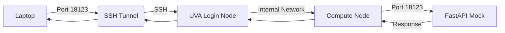

# Cloudmesh AI Commander Workflow

**Contact**: **Gregor von Laszewski** ([laszewski@gmail.com](mailto:laszewski@gmail.com))

## Overview

This workflow provides a complete guide to deploying and accessing a **Gemma 4** mock AI service on a UVA GPU compute node. 

Because the model requires significant GPU resources, it is hosted on a UVA GPU compute node. To interact with the server from a local machine, the `cloudmesh-ai-commander` extension automates the process of requesting a compute node via iJob, deploying the server, and establishing a secure SSH tunnel to forward traffic from the laptop to the specific compute node allocated by the cluster.

---

# Quick Start

For returning users, here is the essential command sequence:

1. **VPN**: `cmc vpn connect`
2. **Deploy**: `cmc commander run mock --port 18123 --partition bii-gpu`
3. **Test**: `curl http://localhost:18123/v1/models`

---

# Nomenclature

To make this guide easier to follow, we use the following shorthand for terminals and hosts:

| Icon | Terminal | Role | Host | Description |
| :--- | :--- | :--- | :--- | :--- |
| <span style="color: #007bff;"><span style="font-size: 2em;">❶</span></span> | **Terminal 1** | Orchestration | `laptop` | Running `cmc commander` to manage the cluster |
| <span style="color: #28a745;"><span style="font-size: 2em;">❷</span></span> | **Terminal 2** | Tunneling | `laptop` $\rightarrow$ `uva` | Dedicated session to maintain the SSH tunnel |
| <span style="color: #fd7e14;"><span style="font-size: 2em;">❸</span></span> | **Terminal 3** | Testing | `laptop` | Session for API verification and requests |

---

# 1. Installation

To install the AI Commander extension for local development and use:

## 1.1 Set Up Python Environment
We recommend using `pyenv` to manage your Python version and virtual environment.

<span style="color: #007bff;"><span style="font-size: 2em;">❶</span> [terminal 1 - laptop]</span>
```bash
# Create a virtual environment for the commander
pyenv virtualenv 3.14.4 CMC
pyenv local CMC
```

## 1.2 Install from GitHub Source
Install the package in editable mode directly from the source repository.

<span style="color: #007bff;"><span style="font-size: 2em;">❶</span> [terminal 1 - laptop]</span>
```bash
# Clone the repository (if not already done)
git clone https://github.com/cloudmesh-ai/cloudmesh-ai-commander.git
cd cloudmesh-ai-commander

# Install in editable mode
pip install -e .
```

---

# 2. Prerequisites

Before using the commander, ensure your environment is configured for UVA access.

## 1.1 SSH Configuration
Add the following block to your `~/.ssh/config` file on your laptop:
```text
Host uva
    HostName login.hpc.virginia.edu
    User thf2bn
    ForwardAgent yes
    ServerAliveInterval 60
```

## 1.2 VPN Connection
Establish a secure connection via the Cloudmesh AI VPN.
<span style="color: #007bff;"><span style="font-size: 2em;">❶</span> [terminal 1 - laptop]</span>
```bash
cmc vpn connect
```

---

# 2. Deploying the Mock Server

The `commander` extension replaces the manual process of SSHing into UVA, running `ijob`, and manually starting the server.

## 2.1 Run Mock Orchestrator
The `run mock` command handles the entire lifecycle: requesting a node, deploying the FastAPI mock server, and opening the tunnel.

<span style="color: #007bff;"><span style="font-size: 2em;">❶</span> [terminal 1 - laptop]</span>
```bash
cmc commander run mock --port 18123 --partition bii-gpu
```

> [!IMPORTANT]
> **What happens under the hood:**
> 1. **UVA Login**: Connects to the login node.
> 2. **iJob Allocation**: Requests a GPU node on the specified partition.
> 3. **Deployment**: Uploads and starts `mock_vllm.py` in the background on the compute node.
> 4. **Tunneling**: Launches a background SSH process to map `localhost:18123` $\rightarrow$ `compute-node:18123`.

**✅ Success Criteria**
- [ ] `cmc commander run mock` completes without errors.
- [ ] The output displays the allocated compute node (e.g., `udc-an26-1`).
- [ ] The output confirms the SSH tunnel is established.

---

# 3. Testing the Service

Once the orchestrator completes, you can verify the server is reachable from your laptop.

## 3.1 Verify Endpoint
Open a new terminal to test the API.

<span style="color: #fd7e14;"><span style="font-size: 2em;">❸</span> [terminal 3 - laptop]</span>
```bash
curl http://localhost:18123/v1/models
```

**Expected Response:**
```json
{
  "object": "list",
  "data": [
    {
      "id": "google/gemma-4-31B-it",
      "object": "model"
    }
  ]
}
```

---

# 4. Maintenance & Utilities

## 4.1 Health Check
You can verify if the mock server is still responding without using `curl`.

<span style="color: #fd7e14;"><span style="font-size: 2em;">❸</span> [terminal 3 - laptop]</span>
```bash
cmc commander status --port 18123
```

## 4.2 Manual Tunneling
If you already have a server running on a compute node and only need the tunnel:

<span style="color: #28a745;"><span style="font-size: 2em;">❷</span> [terminal 2 - laptop]</span>
```bash
cmc commander tunnel <compute-node> 18123 18123
```

---

# Mental Model



---

# Rules

> [!CAUTION]
> - **Tunnel Persistence**: The tunnel is a background process. If you kill the process or the laptop sleeps, the connection is lost.
> - **Port Conflicts**: Use high ports (e.g., `18123`) to avoid conflicts with system services.
> - **Node Access**: Never SSH directly into compute nodes; always use the login node as a gateway.
> - **Cleanup**: Remember to terminate your `ijob` session on UVA when finished to free up GPU resources.

---

# Troubleshooting

### Tunnel "Address already in use"
If you see `bind [127.0.0.1]:18123: Address already in use`:
1. Find the PID: `lsof -i :18123`
2. Kill the process: `kill -9 <PID>`
3. Rerun `cmc commander run mock` or `cmc commander tunnel`.

### UVA Login Failures
If `cmc commander` cannot connect to UVA:
- Verify VPN is active: `cmc vpn watch`
- Verify SSH keys are loaded: `ssh-add -l`